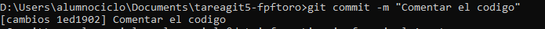

**Clonado del repositorio fork**  
   

**Creación de nueva rama**   
   

**Modificación del archivo**   
   

**Commit**   
   

**Push al fork**   
    

**Creación del Pull Request**   
   
   

**Pull Request aceptado**   
   

**Tagging un commit**   
